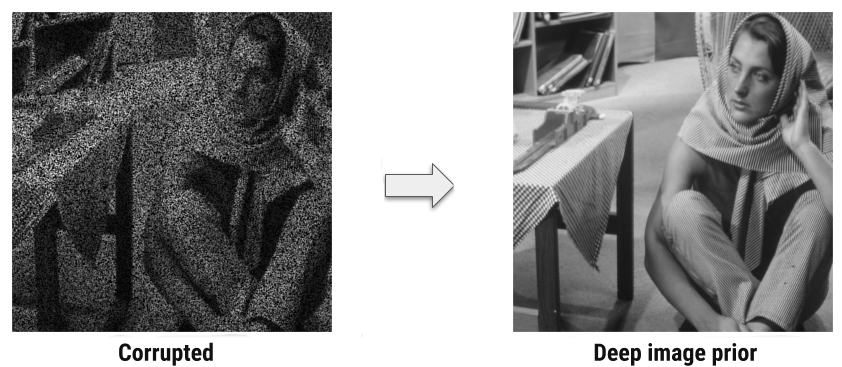

# Deep Image Prior <br> Reproducibility Project

## Introduction
This blog post is for the reproducibility project for the TU Delft Deep Learning course. What we are going to attempt in this blog post is to reproduce the experiments and the results from the paper  "Deep Image Prior"[[1]](#citation-1) without running or consulting its available code.

## Problems tackled by the paper
The problems tackled by the paper are problem of image restoration. Some example of image restoration tasks are for example:
* Image denoising Figure [1](#figure-1) <figure id="figure-1">

  <figcaption>Figure 1 - Example of image denoising</figcaption>
</figure> 
* Image super-resolution Figure [2](#figure-2) <figure id="figure-2">

  <figcaption>Figure 2 - Example of super-resolution</figcaption>
</figure> 
* Image inpainting Figure [3](#figure-3) <figure id="figure-3">

  <figcaption>Figure 3 - Example of image inpainting</figcaption>
</figure> 

The problem that we will focus on in this blog post is a subset of image inpainting which the paper refers to as image reconstruction. The task consists on, given an image <inlineMath>\hat{x}</inlineMath> and a mask <inlineMath>m</inlineMath> where <inlineMath>m\_{ij} \sim Bernoulli(p)</inlineMath> and given that <inlineMath>\hat{x} = m \odot x</inlineMath>, estimate <inlineMath>x</inlineMath>. The main paper performed tests mainly with <inlineMath>p=0.5</inlineMath>. For a more intuitive formulation of the problem, you can check Figure [4](#figure-4), where certain pixel values are missing and what we want to do is reconstruct the entire image.
<figure id="figure-4">
  
  <figcaption>Figure 4 - Example of image reconstruction</figcaption>
</figure> 

## What is Deep Image Prior
In the paper, the authors argue that a great
deal of image statistics are captured by the structure of
a convolutional image generator independent of learning.
What it means is that we can train the generator network on a single degraded image, instead of large dataset of example images,
to reconstruct the image. In this scheme, the network weights serve
as a parametrization of the restored image.  


## How does it work?

Lets assume that our image <inlineMath>x</inlineMath> is under following process:

<inlineMath> x \Rightarrow Degradation \Rightarrow  \hat{x} \Rightarrow  Restoration \Rightarrow x^{*} </inlineMath>

Our goal is to find <inlineMath> x^{*}</inlineMath>.
Assuming there is a probability distribution over the clean image space x and noisy image \hat{x}, we can do that by finding the MAP estimate of our posterior distribution of clean images:

```katex {evaluate: true}
MAP: x^{*} = argmax_{x} p(x|\hat{x})
```

As it is usually the case, obtaining posterior distribution <inlineMath>p(x|\hat{x})</inlineMath> is intractable. We can rewrite the equation using Bayes theorem:

```katex {evaluate: true}
p(x|\hat{x}) = \frac{p(\hat{x}|x)p(x)}{p(\hat{x})} \sim p(\hat{x}|x)p(x)
```
Therefore
```katex {evaluate: true}
MAP: x^{*} = argmax_{x}p(\hat{x}|x)p(x) \\
= argmax_{x} log(p(\hat{x}|x)) + log(p(x)) \\
= argmin_{x} -log(p(\hat{x}|x)) - log(p(x)) \\
= argmin_{x} E(x;\hat{x}) + R(x)
```
where <inlineMath>E(x;\hat{x})</inlineMath> is the information entropy and <inlineMath>R(x)</inlineMath> is a regularizer term.  
This approach exploits the fact that structure of a generator network are surjective mapping of <InlineMath>g:\theta \to x</InlineMath>, hence the formula for optimization task <InlineMath>argmin_x E(x;\hat{x}) + R(x)</InlineMath> becomes <InlineMath>argmin_\theta E(g(\theta);\hat{x}) + R(g(\theta))</InlineMath>. Furthermore, if we select a good mapping <InlineMath>g</InlineMath>, but adjusting network hyperparameters, we could get rid of prior term and utilize a randomly initialized function as fixed input and learn from corrupted image the network parameters <InlineMath>argmin_\theta E(f_\theta(z); \hat{x})</InlineMath>. This parameterization network prefers naturally looking images over noise and descends more quickly in the optimization process, so the generator network provides a prior that corresponds to set of images that can be produced by the network with parameters optimized.


## Developing the Network from the paper
### Structure of The Network
The main paper does not contain the structure of the network. Luckly, the authors provided supplementary material to the paper. In the supplementary material they described the network and the hyper-parameters they used. In the supplementary material, they also provided a diagram with the structure of the network, as you can see in Figure [5](#figure-5), where <InlineMath>n_d[i]</InlineMath> and <InlineMath>k_d[i]</InlineMath> are respectively the number of filters and the kernel size of the convolutional layers of the downsampling connection <InlineMath>d_i</InlineMath>. In the same fashion <InlineMath>n_s[i]</InlineMath> and <InlineMath>k_s[i]</InlineMath> are respectively the number of filters and the kernel size of skip connection <InlineMath>s_i</InlineMath> and <InlineMath>n_u[i]</InlineMath> and <InlineMath>k_u[i]</InlineMath> are respectively the number of filters and the kernel size of upsampling connection <InlineMath>u_i</InlineMath>.

<figure id="figure-5">
  
  <figcaption>Figure 5 - Network Structure</figcaption>
</figure> 

The supplementary material states that the downsampling procedure they used was done by the stride implementation of the convolution, but it also states that the authors got a similar result with average/max pooling and downsampling with Lanczos kernel. In our implementation we decided to use max pooling. The upsampling operation is dependent on the application, but the only used upsampling operations are nearest upsampling and bilinear upsampling. 
Our implementation of <InlineMath>d_i</InlineMath> is the following where `channels_out` is <InlineMath>n_d[i]</InlineMath> and `kernel_size` is <InlineMath>k_d[i]</InlineMath>

```python  
class Down(nn.Module):
    def __init__(self, channels_in, channels_out, kernel_size, activation=nn.LeakyReLU()):
        super(Down, self).__init__()
        self.downsample = nn.Sequential(
            nn.Conv2d(channels_in, channels_out, kernel_size, padding=get_padding_by_kernel(kernel_size)),
            nn.MaxPool2d((2, 2)),
            nn.BatchNorm2d(channels_out),
            activation,

            nn.Conv2d(channels_out, channels_out, kernel_size, padding=get_padding_by_kernel(kernel_size)),
            nn.BatchNorm2d(channels_out),
            activation,
        )

    def forward(self, x):
        return self.downsample(x)
```
Our implementation of <InlineMath>s_i</InlineMath> where `channels_out` is <InlineMath>n_s[i]</InlineMath> and `kernel_size` is <InlineMath>k_s[i]</InlineMath>
```python
class Skip(nn.Module):
    def __init__(self, channels_in, channels_out, kernel_size, activation=nn.LeakyReLU()):
        super(Skip, self).__init__()

        self.skipsample = nn.Sequential(
            nn.Conv2d(channels_in, channels_out, kernel_size, padding=get_padding_by_kernel(kernel_size)),
            nn.BatchNorm2d(channels_out),
            activation,
        )

    def forward(self, x):
        return self.skipsample(x)
```
Our implementation of <InlineMath>u_i</InlineMath> where `channels_out` is <InlineMath>n_u[i]</InlineMath> and `kernel_size` is <InlineMath>k_u[i]</InlineMath>
```python
class Up(nn.Module):

    def __init__(self, channels_in, channels_out, kernel_size, upsampling_method, activation=nn.LeakyReLU()):
        super(Up, self).__init__()

        self.upsample = nn.Sequential(
            nn.BatchNorm2d(channels_in),

            nn.Conv2d(channels_in, channels_out, kernel_size, padding=get_padding_by_kernel(kernel_size)),
            nn.BatchNorm2d(channels_out),
            activation,

            nn.Conv2d(channels_out, channels_out, 1),
            nn.BatchNorm2d(channels_out),
            activation,

            nn.Upsample(scale_factor=2, mode=upsampling_method)
        )

    def forward(self, x):
        return self.upsample(x)
```
Because we are going to tackle the problem of image reconstruction, we are going to use the hyperparameters provided by the supplementary material for the image reconstruction problem which are the following:

```katex {evaluate: true}
z \in \R^{32xWxH} \sim U(0,\frac{1}{10})\\
n_u = n_d = [128, 128, 128, 128, 128] \\
k_u = k_d = [3, 3, 3, 3, 3] \\
n_s = [4, 4, 4, 4, 4] \\
k_s = [1, 1, 1, 1, 1] \\
\sigma_p = \frac{1}{30} \\
\text{num\_iter} = 11000 \\ 
\text{LR} = 0.001 \\ 
\text{upsampling} = \text{bilinear}
```

### Peculiarities In The Network Structure
Firstly as you can see from Figure [5](#figure-5), the last operation from the network is the upsampling procedure. Because the upsampling procedure is either bilinear or nearest, the resulting image is blurry regardless of the network input and the network weights.  
Secondly in the case of image reconstruction, <InlineMath>n_s[5]=4</InlineMath>, which means that the number of filters and consequently the number of channels of the output image is <InlineMath>4</InlineMath>. The paper in the case of image reconstruction experiments with gray-scale images, therefore the output image should have <InlineMath>1</InlineMath> channel in total and not <InlineMath>4</InlineMath>.  
Thirdly, because the last activation function is `Leaky ReLu` the range of possible  pixel values of the resulting image is <InlineMath>(-\infin,\infin)</InlineMath> instead of <InlineMath>[0, 1]</InlineMath>.  
Fourthly, in the case of the hyperparameters provided for large hole inpainting where <InlineMath>n_s = [0, 0, 0, 0, 0, 0] </InlineMath> and <InlineMath> k_s=
[\text{NA}, \text{NA}, \text{NA}, \text{NA}, \text{NA}, \text{NA}]</InlineMath> which can be interpreted as skip connections being omitted. But given the structure shown in Figure [5](#figure-5) the only connection between the encoder and the decoder are the skip connections, which makes omitting all the skip connections not possible.

### Resolving The Peculiarities
To solve these peculiarities, we added components from the original U-Net[[2]](#citation-2) architecture.  
To make sure that the output image, is not blurry, has the right amount of channels and has possible pixel values only within the range <InlineMath>[0, 1]</InlineMath> we added a convolutional layer  with a sigmoid activation function after the last upsampling in the same way it was done in the original U-Net architecture.  The implementation of the last layer is:

```python
class OutConv(nn.Module):
    def __init__(self, channels_in, channels_out=3):
        super(OutConv, self).__init__()

        self.outconv = nn.Sequential(
            nn.Conv2d(channels_in, channels_out, 1),
            nn.Sigmoid(),
        )

    def forward(self, x):
        return self.outconv(x)
```
To make sure that the encoder and the decoder are connected even without the skip connections, we added layers between the encoder's last layer and the decoder's first layer the same way it was done in the original U-Net architecture.
```python
class Connect(nn.Module):
    def __init__(self, channels_in, channels_out, kernel_size, upsampling_method, activation=nn.LeakyReLU()):
        super(Connect, self).__init__()

        self.connect = nn.Sequential(
            nn.MaxPool2d((2, 2)),
            nn.Conv2d(channels_in, channels_out, kernel_size, padding=get_padding_by_kernel(kernel_size)),
            nn.BatchNorm2d(channels_out),
            activation,

            nn.Conv2d(channels_out, channels_out, kernel_size, padding=get_padding_by_kernel(kernel_size)),
            nn.BatchNorm2d(channels_out),
            activation,

            nn.Upsample(scale_factor=2, mode=upsampling_method)
        )

    def forward(self, x):
        return self.connect(x)
```
### Putting It All Together

The architecture of the entire network is the following where:

* `config["channels_down"]` is <inlineMath>n_d</inlineMath> 
* `config["channels_up"]` is <inlineMath>n_u</inlineMath>, 
* `config["channels_skip"]` is <inlineMath>n_s</inlineMath>
* `config["kernels_down"]` is <inlineMath>k_d</inlineMath> 
* `config["kernels_up"]` is <inlineMath>k_u</inlineMath>, 
* `config["kernels_skip"]` is <inlineMath>k_s</inlineMath>

<collapse>

```python
class UNet(nn.Module):
    def __init__(self, channels, out_channels, config):
        super(UNet, self).__init__()
        self.channels_down = config["channels_down"]
        self.channels_up = config["channels_up"]
        self.channels_skip = config["channels_skip"]

        self.kernels_down = config["kernels_down"]
        self.kernels_up = config["kernels_up"]
        self.kernels_skip = config["kernels_skip"]

        self.upsampling_method = config["upsampling_method"]

        self.down = nn.ModuleList()
        for i in range(len(self.channels_down)):
            self.down.append(
                Down(
                    self.channels_down[i - 1] if i > 0 else channels,
                    self.channels_down[i],
                    self.kernels_down[i]
                )
            )

        self.skip = nn.ModuleList()
        for i in range(len(self.channels_skip)):
            if self.channels_skip[i] > 0:
                self.skip.append(
                    Skip(
                        self.channels_down[i],
                        self.channels_skip[i],
                        self.kernels_skip[i]
                    )
                )
            else:
                self.skip.append(None)

        self.connect_layer = Connect(
            self.channels_down[-1],
            self.channels_up[-1],
            self.kernels_down[-1],
            self.upsampling_method
        )

        self.up = nn.ModuleList()
        for i in range(len(self.channels_up)):
            self.up.append(
                Up(
                    self.channels_up[i] + self.channels_skip[i],
                    self.channels_up[i - 1] if i > 0 else self.channels_up[i],
                    self.kernels_up[i],
                    self.upsampling_method
                )
            )

        self.out_conv = OutConv(self.channels_up[0], out_channels)

    def forward(self, x):
        out = x
        x_downsampled = []
        for i in range(len(self.channels_down)):
            out = self.down[i](out)
            x_downsampled.append(out)

        out = self.connect_layer(out)

        for i in reversed(range(len(self.channels_up))):
            if self.channels_skip[i] > 0:
                out = self.up[i](torch.cat([out, self.skip[i](x_downsampled[i])], dim=1))
            else:
                out = self.up[i](out)

        return self.out_conv(out)
```
</collapse>

## Learning process
As described in the paper,the loss function is <inlineMath>||(f_\theta(z) - \hat{x}) \odot m||^2</inlineMath>, where <inlineMath>m_{ij}=0</inlineMath> if <inlineMath>\hat{x}\_{ij}</inlineMath> is a missing pixel and <inlineMath>m\_{ij}=1</inlineMath> if the value <inlineMath>\hat{x}\_{ij}</inlineMath> is known. Adam optimizer was used with learning rate <inlineMath>RL=0.0001</inlineMath> for <inlineMath>11000</inlineMath> iterations.  
In the supplementary material, the authors described that the optimization process destabilizes for low values of the loss function, and there after the loss function increases at consequent iterations of the optimization process. Their approach to remedy this problem was to check when the loss would be noticibly greater then its value in the previouse iteration and restore its weights to the values from the previouse iteration. We noticed that this approach does not prevent the optimization process from destabilizing after the weights were restored, therefore we also diminished the learning rate to <inlineMath>LR' = 0.9LR</inlineMath> whenever the weights were restored.  
In the following plot you can see the learning process and how the change in the learning rate stabilizes the optimization process.  
    
**Image Selected:** {selector}
{comparison}
{plot}


## Experimental Results
### PSNR per picture

|              PSNR| Barbara | Boat  | House | Lena  | Peppers | C.man | Couple | Finger | Hill  | Man   | Montage |
| ---------------- | ------- | ----- | ----- | ----- | ------- | ----- | ------ | ------ | ----- | ----- | ------- |
| Ours             | 24.14   | 28.19 | 32.64 | 32.71 | 26.44   | 26.19 | 28.08  | 27.10  | 29.09 | 29.62 | 29.62   |
| Deep Image Prior | 32.22   | 33.06 | 39.16 | 36.16 | 33.05   | 29.8  | 32.52  | 32.84  | 32.77 | 32.20 | 34.54   |


As you can see from the table, we did not reach the performance from the main paper. This might be due to the wrong assumptions taken in the network architecture. Nevertheless the generated images seem realistic and they seem to confirm the hypothesis that the structure of the Convolutional Neural Network contains realistic looking prior knowledge.
### References

<div id="citation-1"><strong>[1]</strong>: Ulyanov D, Vedaldi A, Lempitsky V. Deep image prior. InProceedings of  the IEEE Conference on Computer Vision and Pattern Recognition 2018 (pp. 9446-9454).</div>

<div id="citation-2"><strong>[2]</strong>: Li X, Chen H, Qi X, Dou Q, Fu CW, Heng PA. H-DenseUNet: hybrid densely connected UNet for liver and tumor segmentation from CT volumes. IEEE transactions on medical imaging. 2018 Jun 11;37(12):2663-74.</div>
