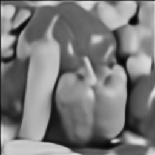
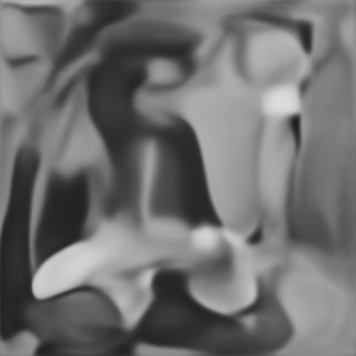
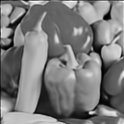
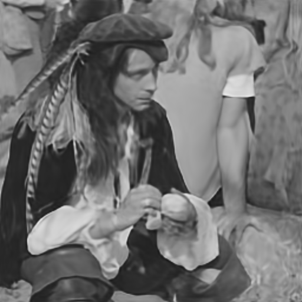
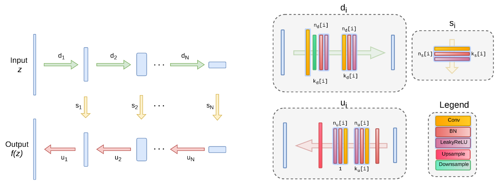
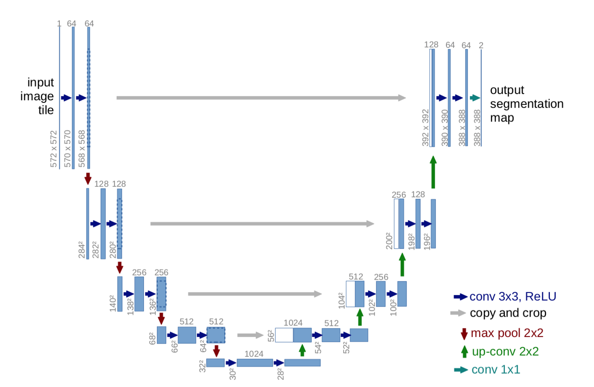

# Deep Image Prior <br> Reproducibility Project

## Introduction
This blog post is for the reproducibility project for the TU Delft Deep Learning course.
 What we are going to attempt in this blog post is to reproduce the experiments and the results from the paper  "Deep Image Prior"[[1]](#citation-1) without running or consulting its available code.
 
Traditionally we approach towards any optimization task on image by learning image prior from training samples, the larger the number of samples the better the results. Author of this paper propose a method to circumvent capturing a prior by learning on samples but rather capturing prior of Convolutional network's parameters. 


## Method
This approach exploits the fact that structure of a generator network are surjective mapping of g:0 -> x, hence the formula for optimization task min E(x;x0) + R(x) becomes min E(g(0);x0) + R(g(0)). Furthermore, if we select a good mapping g, but adjusting network hyperparameters, we could get rid of prior term and utilise a randomly initialized function as fixed input and learn from corrupted image the network parameters min E(f(z); x0). This parameterization network prefers naturally looking images over noise and descends more quickly in the optimization process, so the generator network provides a prior that corresponds to set of images that can be produced by the network with parameters optimized.


## Experiments of the paper
The paper demonstrates that the success of Convolutional Neural Networks is not only attributed by the prior knowledge gained from the training data but also from the prior knowledge attributed to the structure of the network. The paper demonstrates this by using an untrained U-Net[[2]](#citation-2) to restore images.
The types of images restoration performed by the paper are:


### Restoration Process
Iteration 0


250 Iteration 
.
.

1000 Iteration 
.
.

2000 Iteration 
.
.

5000 Iteration 
.
.

Iteration 11000
.
.


* Image denoising
* Image inpainting
* Image super-resolution

## Experiment to reproduce

|                  | Barbara   | Boat      | House     | Lena      | Peppers   | C.man    | Couple    | Finger    | Hill      | Man       | Montage   |
| ---------------- | --------- | --------- | --------- | --------- | --------- | -------- | --------- | --------- | --------- | --------- | --------- |
| Papyan et al.    | 28.14     | 31.44     | 34.58     | 35.04     | 31.11     | 27.90    | 31.18     | 31.34     | 32.35     | 31.92     | 28.05     |
| Deep Image Prior | **32.22** | **33.06** | **39.16** | **36.16** | **33.05** | **29.8** | **32.52** | **32.84** | **32.77** | **32.20** | **34.54** |


```
Test code
```

<InlineMath>c = \pm\sqrt{a^2 + b^2}</InlineMath>

test math blocks
```katex {evaluate: true}
c = \pm \sqrt{a^2 + b^2}
```

<button>1Test html</button>

Citation to Unet [[2]](#citation-2)





### References

<div id="citation-1"><strong>[1]</strong>: Ulyanov D, Vedaldi A, Lempitsky V. Deep image prior. InProceedings of  the IEEE Conference on Computer Vision and Pattern Recognition 2018 (pp. 9446-9454).</div>

<div id="citation-2"><strong>[2]</strong>: Li X, Chen H, Qi X, Dou Q, Fu CW, Heng PA. H-DenseUNet: hybrid densely connected UNet for liver and tumor segmentation from CT volumes. IEEE transactions on medical imaging. 2018 Jun 11;37(12):2663-74.</div>

<div id="citation-3"><strong>[3]</strong>: Papyan V, Romano Y, Sulam J, Elad M. Convolutional dictionary learning via local processing. InProceedings of the IEEE International Conference on Computer Vision 2017 (pp. 5296-5304).</div>
