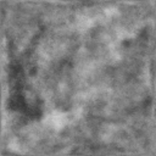
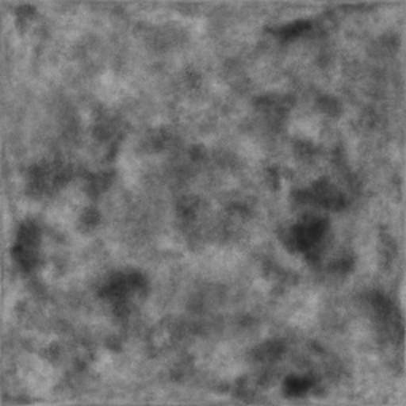
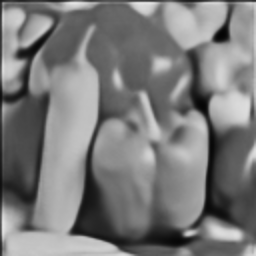
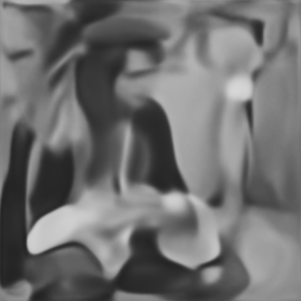
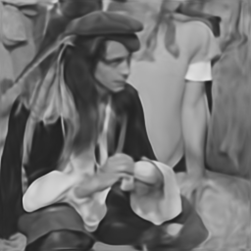
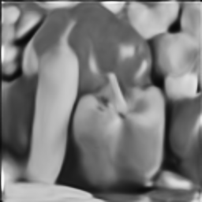
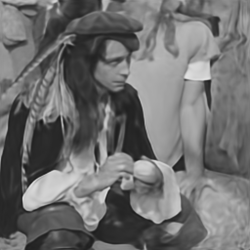

# Deep Image Prior <br> Reproducibility Project

## Introduction
This blog post is for the reproducibility project for the TU Delft Deep Learning course. What we are going to attempt in this blog post is to reproduce the experiments and the results from the paper  "Deep Image Prior"[[1]](#citation-1) without running or consulting its available code.

## What the paper is about
The problems tackled by the paper are problem of image restoration. Some example of image restoration tasks are for example:
* Image denoising
* Image superresolution
* Image inpainting

## Bla
Traditionally, Our approach towards any optimization task on image is by learning image prior from the training samples, the larger the number of samples the better the results. Author of this paper propose a method to circumvent capturing a prior by learning on samples but rather capturing prior of Convolutional network's parameters called as Deep Image Prior. 


## Method
This approach exploits the fact that structure of a generator network are surjective mapping of <InlineMath>g:0 -> x</InlineMath>, hence the formula for optimization task <InlineMath>min E(x;x0) + R(x)</InlineMath> becomes <InlineMath>min E(g(0);x0) + R(g(0))</InlineMath>. Furthermore, if we select a good mapping g, but adjusting network hyperparameters, we could get rid of prior term and utilise a randomly initialized function as fixed input and learn from corrupted image the network parameters <InlineMath>min E(f(z); x0)</InlineMath>. This parameterization network prefers naturally looking images over noise and descends more quickly in the optimization process, so the generator network provides a prior that corresponds to set of images that can be produced by the network with parameters optimized.


## Developing the Network from the paper
The main paper does not contain the structure of the network they used. Luckly, the authors of the paper provided a supplementary material document. In there they describe the netwrok they used and the hyper-parameters. In the suplementary material, they also provide a diagram with the structure of the network, as you can see in Figure [1](#figure-1), where <InlineMath>n_d[i]</InlineMath> and <InlineMath>k_d[i]</InlineMath> are respectivelly the number of filters and the kernel size of the convolutional layers of the downsampling connection <InlineMath>d_i</InlineMath>. In the same fashion <InlineMath>n_s[i]</InlineMath> and <InlineMath>k_s[i]</InlineMath> are respectivelly the number of filters and the kernel size of skip connection <InlineMath>s_i</InlineMath> and <InlineMath>n_u[i]</InlineMath> and <InlineMath>k_u[i]</InlineMath> are respectivelly the number of filters and the kernel size of upsampling connection <InlineMath>u_i</InlineMath>.

<figure id="figure-1">
  
  <figcaption>Figure 1 - Network Structure</figcaption>
</figure> 

The supplementary material state that the downsampling procedure they used was done by the stride implementation of the convolution, but they also state that they got a similar result with average/max pooling and downsampling with Lanczos kernel. In out implementation we decided to use max pooling. The upsampling operation is dependant on the application, but in the possible upsampling operations are nearest and bilinear. 
Our implementation of <InlineMath>d_i</InlineMath> is the following where `channels_out` is <InlineMath>n_d[i]</InlineMath> and `kernel_size` is <InlineMath>k_d[i]</InlineMath>

```python  
class Down(nn.Module):
    def __init__(self, channels_in, channels_out, kernel_size, activation=nn.LeakyReLU()):
        super(Down, self).__init__()
        self.downsample = nn.Sequential(
            nn.Conv2d(channels_in, channels_out, kernel_size, padding=get_padding_by_kernel(kernel_size)),
            nn.MaxPool2d((2, 2)),
            nn.BatchNorm2d(channels_out),
            activation,

            nn.Conv2d(channels_out, channels_out, kernel_size, padding=get_padding_by_kernel(kernel_size)),
            nn.BatchNorm2d(channels_out),
            activation,
        )

    def forward(self, x):
        return self.downsample(x)
```
Our implementation of <InlineMath>s_i</InlineMath> where `channels_out` is <InlineMath>n_s[i]</InlineMath> and `kernel_size` is <InlineMath>k_s[i]</InlineMath>
```python
class Skip(nn.Module):
    def __init__(self, channels_in, channels_out, kernel_size, activation=nn.LeakyReLU()):
        super(Skip, self).__init__()

        self.skipsample = nn.Sequential(
            nn.Conv2d(channels_in, channels_out, kernel_size, padding=get_padding_by_kernel(kernel_size)),
            nn.BatchNorm2d(channels_out),
            activation,
        )

    def forward(self, x):
        return self.skipsample(x)
```
Our implementation of <InlineMath>u_i</InlineMath> where `channels_out` is <InlineMath>n_u[i]</InlineMath> and `kernel_size` is <InlineMath>k_u[i]</InlineMath>
```python
class Up(nn.Module):

    def __init__(self, channels_in, channels_out, kernel_size, upsampling_method, activation=nn.LeakyReLU()):
        super(Up, self).__init__()

        self.upsample = nn.Sequential(
            nn.BatchNorm2d(channels_in),

            nn.Conv2d(channels_in, channels_out, kernel_size, padding=get_padding_by_kernel(kernel_size)),
            nn.BatchNorm2d(channels_out),
            activation,

            nn.Conv2d(channels_out, channels_out, 1),
            nn.BatchNorm2d(channels_out),
            activation,

            nn.Upsample(scale_factor=2, mode=upsampling_method)
        )

    def forward(self, x):
        return self.upsample(x)
```
Because we are going are tackling the problem of image reconstruction, we are going to use the hyperparameters provided by the supplementary material for the image reconstruction problem which are the following:

```katex {evaluate: true}
z \in \R^{32xWxH} \sim U(0,\frac{1}{10})\\
n_u = n_d = [128, 128, 128, 128, 128] \\
k_u = k_d = [3, 3, 3, 3, 3] \\
n_s = [4, 4, 4, 4, 4] \\
k_s = [1, 1, 1, 1, 1] \\
\sigma_p = \frac{1}{30} \\
\text{num\_iter} = 2000 \\ 
\text{LR} = 0.01 \\ 
\text{upsampling} = \text{bilinear}
``` 

### Peculiarities From The Network Structure
Firstly as you can see from Figure [1](#figure-1), the last operation from the network is the upsampling procedure. Because the upsampling procedure is either bilinear or nearest, the resulting image is blury regardless of the network input and the network weights.  
Secondly another peculiarity is that in the case of image reconstruction, <InlineMath>n_s[5]=4</InlineMath>, which means that the number of filters and consecuently the number of channels of the output image is <InlineMath>4</InlineMath>. The paper in the case of image reconstruction experiments with grayscale images, therefore the output image should have <InlineMath>1</InlineMath> channel in total and not <InlineMath>4</InlineMath>.  
Thirdly, because the last activation function is `Leaky ReLu` the range of possible  pixel values of the resulting image is <InlineMath>(-\infin,\infin)</InlineMath> instead of <InlineMath>[0, 1]</InlineMath>.  
Forthly, in the case of the hyperparameters provided for large hole inpainting <InlineMath>n_s = [0, 0, 0, 0, 0, 0] </InlineMath> and <InlineMath> k_s=
[\text{NA}, \text{NA}, \text{NA}, \text{NA}, \text{NA}, \text{NA}]</InlineMath> which means that skip connections are omitted. But given the structure given in Figure [1](#figure-1) the only connection between the encoder and the decoder are the skip connections, which makes omitting of all the skip connections not possible.
## A
The paper demonstrates that the success of Convolutional Neural Networks is not only attributed by the prior knowledge gained from the training data but also from the prior knowledge attributed to the structure of the network. The paper demonstrates this by using an untrained U-Net[[2]](#citation-2) to restore images.
The types of images restoration performed by the paper are:


### Restoration Process
Iteration 0
.
.

250 Iteration 
.
.

1000 Iteration 
.
.

2000 Iteration 
.
.

5000 Iteration 
.
.

Iteration 11000
.
.


* Image denoising
* Image inpainting
* Image super-resolution

## Experiment to reproduce

|                  | Barbara   | Boat      | House     | Lena      | Peppers   | C.man    | Couple    | Finger    | Hill      | Man       | Montage   |
| ---------------- | --------- | --------- | --------- | --------- | --------- | -------- | --------- | --------- | --------- | --------- | --------- |
| Papyan et al.    | 28.14     | 31.44     | 34.58     | 35.04     | 31.11     | 27.90    | 31.18     | 31.34     | 32.35     | 31.92     | 28.05     |
| Deep Image Prior | **32.22** | **33.06** | **39.16** | **36.16** | **33.05** | **29.8** | **32.52** | **32.84** | **32.77** | **32.20** | **34.54** |


```
Test code
```

<InlineMath>c = \pm\sqrt{a^2 + b^2}</InlineMath>

test math blocks
```katex {evaluate: true}
c = \pm \sqrt{a^2 + b^2}
```

<button>1Test html</button>

Citation to Unet [[2]](#citation-2)


{selector}
{comparison}
{plot}

### References

<div id="citation-1"><strong>[1]</strong>: Ulyanov D, Vedaldi A, Lempitsky V. Deep image prior. InProceedings of  the IEEE Conference on Computer Vision and Pattern Recognition 2018 (pp. 9446-9454).</div>

<div id="citation-2"><strong>[2]</strong>: Li X, Chen H, Qi X, Dou Q, Fu CW, Heng PA. H-DenseUNet: hybrid densely connected UNet for liver and tumor segmentation from CT volumes. IEEE transactions on medical imaging. 2018 Jun 11;37(12):2663-74.</div>

<div id="citation-3"><strong>[3]</strong>: Papyan V, Romano Y, Sulam J, Elad M. Convolutional dictionary learning via local processing. InProceedings of the IEEE International Conference on Computer Vision 2017 (pp. 5296-5304).</div>
